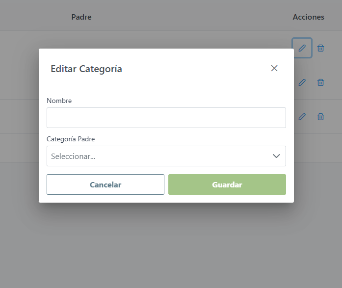

# Inventario - Frontend

Aplicación web para la gestión de inventario de un taller mecánico. Desarrollada con Angular 14, PrimeNG, NGRX y RxJS.

## Funcionalidades

1. Dashboard con KPIs y gráfico de categorías

2. Listado de productos con paginación y filtros

3. Búsqueda por nombre y categoría

4. Crear, editar y eliminar productos

5. Modo oscuro

6. Vista detallada de productos con historial de movimientos

7. Validaciones en formularios

8. Autenticación

9. Responsive design

10. Pruebas unitarias con coverage

## Tecnologías utilizadas

- Angular 14
- PrimeNG
- NGRX (Store, Effects)
- RxJS
- TailwindCSS
- Chart.js
- TypeScript

## Instalación

```
git clone https://github.com/belenamiune/inventory-car-frontend
cd challenge-project
npm install
ng serve
```

## Demo





## Repositorios del proyecto

Este proyecto forma parte de un sistema completo

| Parte    | Repo                                                                            |
| -------- | ------------------------------------------------------------------------------- |
| Frontend | [inventory-car-frontend](https://github.com/belenamiune/inventory-car-frontend) |
| Backend  | [inventory-car-backend](https://github.com/belenamiune/inventory-car-backend)   |

## Author

- [@belenamiune](https://github.com/belenamiune)
